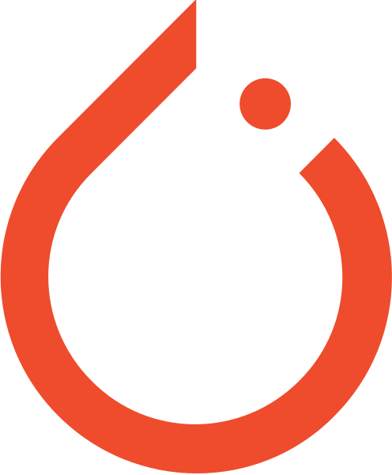
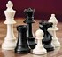

<!--
https://docs.github.com/en/get-started/writing-on-github/getting-started-with-writing-and-formatting-on-github/basic-writing-and-formatting-syntax
-->

## Hi there 👋 I'm Debayan Paul. Welcome to my Github Profile!

I have experience as a **Full Stack Developer** in a [Startup](https://upscalepics.com/). My work involved utilizing technologies such as VueJS, ReactJS, NodeJS and PostgreSQL.

I have started my **transition to ML** after I came to know about Generative AI and [Devin.ai](https://preview.devin.ai/) (which is a "AI software developer").

**Technologies** I work with / have some experience / currently learning: 

 &nbsp;  &nbsp;  &nbsp;  &nbsp;  &nbsp;  &nbsp;  

<!-- Python, PyTorch, C++, Golang, NextJS, Postgres, AWS -->

I also have interest in **TinyML, Embedded Systems, IOT and Robotics**. 

### **ML**

 [Kaggle](https://www.kaggle.com/pauldebayan) &nbsp;&nbsp;
 [HuggingFace](https://huggingface.co/pauldebayan)

### **Coding**

 [Leetcode](https://leetcode.com/u/pauldebayan) &nbsp;&nbsp;  [Codeforces](https://codeforces.com/profile/pauldebayan)

### **Connect**

 [LinkedIn](https://www.linkedin.com/in/pauldebayan) &nbsp;&nbsp;  [Youtube](https://www.youtube.com/@pauldebayan) 

### **Others**

 [Chess](https://www.chess.com/member/pauldebayan)

